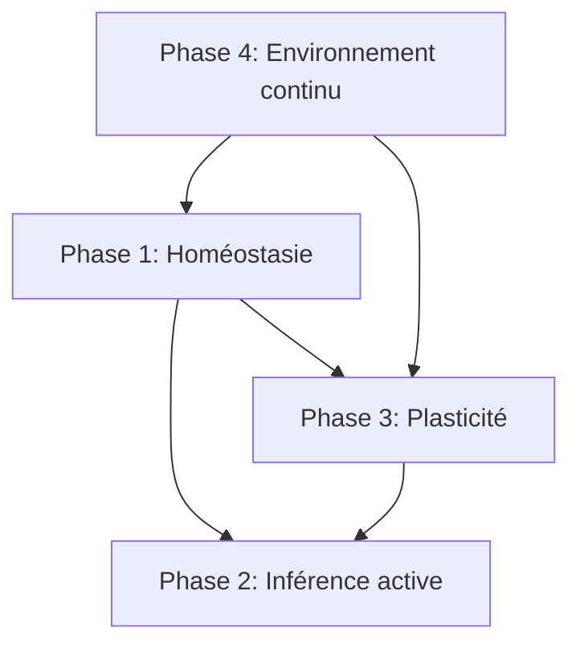

# TSO → Organisme Intelligent : Feuille de route architecturale

## Synthèse de la trajectoire

| Moteur TSO actuel (résolutif) | Organisme intelligent (autopoïétique) |
|---|---|
| Maximise Reward TD(λ) | Minimise la dérive interne (EFE + Φ) |
| Graphe logique fixe | Neurogenèse / Élagage dynamique |
| Φ = Contradiction logique | Φ = Tension vitale + Désaccord perceptif |
| Entrée événementielle | Boucle Perception-Action-Homéostasie |

## Phase 1 — Ancrage homéostatique de Φ

### Objectif
Transformer Φ d'une mesure de contradiction logique en une mesure de menace métabolique.

### Actions
- [x] Réactiver `hypothalamus.rs` par défaut (`CognitiveConfig::hypothalamus = true` dans Default)
- [x] Définir un espace d'états internes : énergie, hydratation, température (struct `Hypothalamus`)
- [x] Coupler Φ à la dérive homéostatique : `Φ_total = Φ_graph + homeostatic_drift` (implémenté dans step() et heartbeat_dt(), 3 tests PASS)
- [x] Biaiser la sélection d'actions vers la réduction de la dérive : `homeostatic_drive_bonus = 0.3` module ε et noise par la faim
- [x] Valider sur un environnement avec ressource périssable (Terrarium consumable + respawn en 15 pas)

### Code existant
- `hypothalamus.rs` — `Hypothalamus::new()`, `step()`, `gate_reward()`, `apply_metabolic_cost()`
- `CognitiveConfig::hypothalamus` — feature flag + runtime gate
- `Hypothalamus::consummatory_value()` — déjà calculé mais non utilisé (mis à 0.0 dans step())

### Verrous
- Benchmarks RL actuels (MiniGrid) n'ont pas de signal homéostatique
- Besoin d'un environnement avec **ressources périssables** (énergie qui se dégrade avec le temps)

## Phase 2 — Inférence active et anticipation

### Objectif
Passer d'un agent réactif TD(λ) à un agent qui simule des trajectoires futures.

### Actions
- [ ] Activer `active-inference` dans le cycle step() pour calculer l'EFE des actions candidates
- [ ] Remplacer progressivement ε-greedy par une politique EFE quand Φ est bas
- [ ] Curiosité intrinsèque : sélectionner des actions qui réduisent l'incertitude sur la dynamique
- [ ] Simuler des trajectoires futures dans le graphe G_t pour minimiser E[Φ_{t+k}]

### Code existant
- `fpi.rs`, `efe.rs`, `inference.rs`, `learning.rs`, `model.rs` — implémentés, feature-gatés
- `crate::efe::score_policy()` — appelé dans step() conditionnellement (cc.efe_weight > 0.0)
- `perceptual_belt.rs::categorize_fpi()` — catégorisation FPI, gated

### Verrous
- Les modules FPI/EFE sont conçus pour un modèle génératif discret, pas pour le graphe Φ continu
- API `score_policy()` ne prend pas de graphe — besoin d'une couche d'adaptation

## Phase 3 — Plasticité autopoïétique

### Objectif
Permettre au système de se restructurer sans s'effondrer.

### Actions
- [ ] Neurogenèse conditionnelle : si Φ reste élevé → créer de nouveaux nœuds/attracteurs
- [ ] Élagage dynamique : si nœuds inactifs ou non-résolvants → suppression
- [ ] R-STDP : remplacer le contrôle global par une consolidation synaptique locale
- [ ] Neuromodulation : Φ élevé → signal noradrénaline-like → augmente plasticité locale

### Code existant
- `neurogenesis.rs` — `sleep_neurogenesis_rate: 0.0` par défaut, non testé en benchmark
- `plasticity.rs` — RstdpPlasticity, feature-gaté `rstdp`, API non compatible ndarray
- `prune_concepts()` dans `tso_engine.rs` — pruning périodique existant
- Sleep cycle : `sleep_every_n_episodes`, `sleep_replay_epochs` — déjà dans CognitiveConfig

### Verrous
- Neurogenèse non testée — besoin d'un benchmark avec suivi du nombre de concepts
- R-STDP utilise `Vec<Vec<f64>>` au lieu de `Array2` — incompatible avec le reste

## Phase 4 — Environnement continu et multimodal

### Objectif
Valider les contraintes topologiques dans des espaces continus et bruités.

### Actions
- [ ] Passer à un environnement physique 2D/3D avec lois permanentes (inertie, gravité)
- [ ] Finaliser l'intégration de `perceptual_belt.rs` dans `step()` (actuellement partielle)
- [ ] Tester la robustesse au bruit sensoriel

### Code existant
- `perceptual_belt.rs` — `process()` appelé dans step() mais seulement pour FPI/Attractor
- `attention.rs` — attention spatiale, désactivée par défaut
- `grid_cells.rs` — encodage de position, configuré via `configure_for_grid()`

### Verrous
- Pas d'environnement continu dans le benchmark actuel
- Intégration PerceptualBelt partielle — Dual-LIF + attention spatiale déjà appelés mais pas fusionnés

## Dépendances entre phases

La Phase 2 nécessite les Phases 1 et 3 (Φ doit être vital avant de pouvoir l'anticiper).
La Phase 4 est un prérequis pour valider les Phases 1 et 3 dans un contexte réaliste.

## Priorité immédiate

1. **Environnement avec ressources périssables** (Phase 1 + 4)
   - Sans cela, l'homéostasie et la neurogenèse n'ont pas de signal à valider
   - Extension simple : Terrarium 5×5 avec nourriture qui apparaît/périt

2. **R-STDP → ndarray** (Phase 3)
   - Refactor mineur : `Vec<Vec<f64>>` → `Array2<f64>`
   - Débloque la plasticité locale dans le cycle step()

3. **Couplage Φ × hypothalamus** (Phase 1)
   - `Φ_total = Φ_graph + homeostatic_drift`
   - Premier pas vers un Φ vital

## Références

- `paper.md` — théorie CDT, architecture TSO
- `specs/product/TSO-CORE.md` — architecture complète par groupes A, B1-B4
- `specs/product/TSO-HYPOTHESES.md` — extensions futures avec priorisation
- `specs/product/TSO-EFFICACY.md` — résultats de validation
